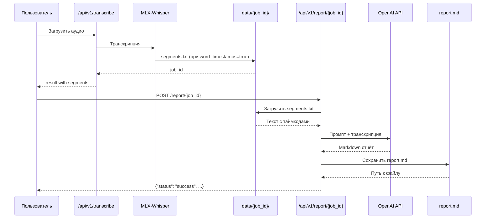

# Техническая спецификация для MLX-Whisper REST API

## Обзор

MLX-Whisper — это высокопроизводительный сервис транскрибации аудио, использующий оптимизированную модель Whisper от Apple (MLX-Whisper) для обработки аудиофайлов на системах macOS с чипами Apple Silicon. Сервис предоставляет как веб-интерфейс, так и REST‑API для преобразования речи в текст с поддержкой нескольких языков и гибкими параметрами обработки.

## Архитектура

### Системные компоненты

1. **FastAPI Web Server**: ядро приложения, обрабатывающее HTTP‑запросы и ответы.
2. **MLX-Whisper Integration**: прямая связь с фреймворком Apple MLX для оптимизированного инференса.
3. **FFmpeg Audio Processing**: преобразование аудиофайлов в требуемый WAV‑формат (16 kHz, моно).
4. **Thread Pool Executor**: управление параллельными задачами транскрипции для оптимального использования ресурсов.
5. **Web Interface**: HTML/JavaScript-фронтенд для удобной загрузки файлов и отображения результатов.

### Технологический стек

- **Backend Framework**: FastAPI (Python 3.8+)
- **MLX Integration**: mlx‑whisper (оптимизированная реализация Whisper от Apple)
- **Audio Processing**: FFmpeg для конвертации форматов
- **Frontend**: HTML, CSS, JavaScript со стилями, похожими на Bootstrap
- **Deployment**: Uvicorn ASGI сервер

### Структура проекта

```
mlx-whisper-api/
├── docs/                   # документация
│   └── technical_specification.md  # эта спецификация
├── models/                 # файлы моделей MLX‑Whisper
│   ├── whisper-tiny/
│   ├── whisper-base/
│   ├── whisper-small/
│   ├── whisper-medium/
│   ├── whisper-turbo/
│   └── whisper-large/
├── src/                    # исходный код
│   ├── main.py             # FastAPI-приложение и логика транскрипции
│   ├── requirements.txt    # зависимости Python
│   ├── static/             # статические ресурсы
│   │   └── new_style.css   # минималистичные стили (светлая/тёмная темы)
│   └── templates/          # HTML-шаблоны
│       ├── new_index.html  # основная веб‑страница (min UI)
│       └── index.html      # старая версия страницы
├── tests/                  # тестовые аудиофайлы
│   ├── test.wav
│   └── 2_5258335770527167268.ogg
├── uploads/                # временное хранилище файлов
├── README.md               # инструкция пользователя
└── .gitignore              # игнорируемые файлы Git
```

## Основные функции

### Цепочка обработки аудио

1. **Валидация загрузки файла**
   - проверка расширений (.wav, .mp3, .m4a, .flac, .aac, .ogg, .wma, .webm, .mp4)
   - ограничение размера (максимум 5 ГБ)
   - проверка корректности формата

2. **Преобразование формата**
   - использование FFmpeg для конвертации в WAV (16 kHz, моно)
   - сохранение качества звука и совместимость с моделью Whisper

3. **Транскрипция**
   - поддержка моделей различных размеров (tiny–large, turbo)
   - задачи «transcribe» или «translate»
   - опциональные временные метки слов
   - использование контекста предыдущего текста

4. **Управление результатами**
   - сохранение в текстовые файлы
   - трекинг статуса задач по уникальным идентификаторам
   - метаданные о процессе обработки

5. **Генерация отчётов через LLM**
   - загрузка segments.txt из директории задания
   - формирование промпта на основе пользовательского шаблона
   - отправка на OpenAI API для генерации Markdown отчёта
   - сохранение report.md в директории задания

### Функции веб‑интерфейса

- drag & drop загрузка аудиофайлов
- выбор языка (авто / вручную)
- выбор типа задачи и размера модели
- сворачиваемая панель расширенных настроек
- переключение светлой/тёмной темы
- отображение прогресса и результатов с возможностью скачивания

## Параметры модели и опции

### Основные параметры модели

1. **`model_size`** — размер модели Whisper (tiny, small, medium, large, turbo).
2. **`language`** — код языка (ISO‑639) или автоопределение.
3. **`task`** — «transcribe» или «translate».

### Параметры обработки аудио

1. **`beam_size`** — размер beam search (по умолчанию 5).
2. **`temperature`** — температура выборки (по умолчанию 0.0).
3. **`top_p`** — top‑p sampling для разнообразия вывода.
4. **`max_length`** — максимальная длина генерируемого текста.

### Расширенные опции

1. **`remove_silence`** — удаление тишины в начале и конце аудио (true/false).
2. **`silence_threshold`** — порог обнаружения тишины в dB (по умолчанию: -60.0).
3. **`silence_duration`** — минимальная длительность тишины для удаления в секундах (по умолчанию: 0.5).
4. **`no_speech_threshold`** — порог отсутствия речи (по умолчанию: 0.6).
5. **`hallucination_silence_threshold`** — порог галлюцинаций/тишины (по умолчанию: 2.0).
6. **`initial_prompt`** — начальный текст для контекстной транскрипции.

### Параметры производительности и оборудования

1. **`compute_type`** — fp32 / fp16 / int8.
2. **`threads`** — число CPU‑потоков.
3. **`device`** — cpu / gpu / mps.
4. **`batch_size`** — пакетная обработка нескольких файлов.

### Параметры вывода и форматирования

1. **`word_timestamps`** — включить временные метки слов.
2. **`no_timestamps`** — отключить метки времени.
3. **`highlight`** — выделить текст в выводе.

### Дополнительные функции

1. **`best_of`** — число лучших кандидатов для beam search.
2. **`verbose`** — подробный лог.

### Генерация отчётов через LLM

1. **`OPENAI_API_KEY`** — API ключ для доступа к OpenAI или совместимому API.
2. **`OPENAI_BASE_URL`** — URL endpoint для кастомных API (например, локальный сервер).
3. **`OPENAI_MODEL`** — модель для генерации отчётов (по умолчанию: gpt-4o-mini).
4. **`OPENAI_REPORT_PROMPT`** — пользовательский промпт для генерации отчётов.

## Параметры конфигурации (.env файл)

### Основные параметры

| Параметр | По умолчанию | Описание |
|----------|--------------|----------|
| `MODEL` | `turbo` | Модель по умолчанию (tiny, base, small, medium, turbo, large) |
| `TASK` | `transcribe` | Тип задачи по умолчанию (transcribe/translate) |
| `LANGUAGE` | пустая строка | Язык по умолчанию (пустая строка = автоопределение) |
| `WORD_TIMESTAMPS` | `false` | Включить word-level timestamps по умолчанию |
| `CONDITION_ON_PREVIOUS` | `true` | Использовать предыдущий текст для контекста |

### Параметры удаления тишины

| Параметр | По умолчанию | Описание |
|----------|--------------|----------|
| `REMOVE_SILENCE` | `true` | Удалять тишину в начале и конце аудио |
| `SILENCE_THRESHOLD` | `-60.0` | Порог для обнаружения тишины в dB |
| `SILENCE_DURATION` | `0.5` | Минимальная длительность тишины для удаления |

### Параметры порогов транскрипции

| Параметр | По умолчанию | Описание |
|----------|--------------|----------|
| `NO_SPEECH_THRESHOLD` | `0.6` | Порог отсутствия речи |
| `HALLUCINATION_SILENCE_THRESHOLD` | `2.0` | Порог галлюцинаций/тишины |

### Параметры промпта

| Параметр | По умолчанию | Описание |
|----------|--------------|----------|
| `INITIAL_PROMPT` | пустая строка | Начальный текст для контекстной транскрипции |

### Параметры генерации отчётов

| Параметр | По умолчанию | Описание |
|----------|--------------|----------|
| `OPENAI_API_KEY` | — | API ключ для доступа к OpenAI API |
| `OPENAI_BASE_URL` | `https://api.openai.com/v1` | URL endpoint для кастомных API |
| `OPENAI_MODEL` | `gpt-4o-mini` | Модель для генерации отчётов |
| `OPENAI_REPORT_PROMPT` | `Создать отчет о сессии...` | Пользовательский промпт для генерации |

## API‑конечные точки

### POST /report/{job_id}

`POST /api/v1/report/{job_id}`

**Описание:** Генерирует Markdown отчёт по расшифровке через LLM.

**Алгоритм:**

1. Проверяет наличие директории `data/{job_id}/`
2. Загружает `*_segments.txt` из директории
3. Формирует промпт на основе `OPENAI_REPORT_PROMPT`
4. Отправляет на OpenAI API для генерации Markdown
5. Сохраняет `report.md` в директории задания

**Ответ:**

```json
{
  "status": "success",
  "job_id": "уникальный_идентификатор_задачи",
  "report_path": "job_id/report.md"
}
```

### POST /transcribe

`POST /api/v1/transcribe`

**Параметры запроса**
(см. раздел 4 для описания опций)

**Формат ответа**

```json
{
  "text": "Распознанный текст",
  "language": "ru",
  "model": "large",
  "task": "transcribe",
  "word_timestamps": true,
  "condition_on_previous_text": true,
  "no_speech_threshold": 0.6,
  "hallucination_silence_threshold": 2.0,
  "segments": [
    {"start":0.0,"end":5.0,"text":"Пример сегмента текста"}
  ],
  "uploaded_file": "job_id_filename.wav",
  "result_file": "job_id_filename.txt",
  "job_id": "уникальный_идентификатор_задачи",
  "duration": 12.34
}
```

### Конечные точки API

```
GET  /health            # проверка работоспособности
GET  /models            # список поддерживаемых моделей
GET  /api/v1/config     # получение текущих настроек
POST /api/v1/transcribe # транскрипция аудио
GET  /job/{job_id}      # статус задачи
POST /api/v1/report/{job_id}  # генерация отчёта через LLM
GET  /                  # корневой веб‑интерфейс
```

## Технические детали реализации

### Оптимизация памяти

- Чтение больших файлов порциями по 8 КБ.
- Обработка аудио данных сегментами.
- ThreadPoolExecutor с двумя рабочими потоками.
- Уникальные идентификаторы и автоматическая очистка временных файлов.

### Обработка ошибок и логирование

- Валидация входных параметров.
- Отлов ошибок FFmpeg.
- Подробные сообщения об ошибках.
- Структурированное логирование; отслеживание времени выполнения и исключений.

### Сериализация данных

- Преобразование NumPy‑типов в нативные Python.
- Обработка NaN/Infinity.
- Формирование структурированного JSON с метаданными и сегментами.

## Характеристики производительности

### Требования к ресурсам

- macOS с Apple Silicon (M1/M2).
- 8 ГБ ОЗУ минимум.
- Диск для временных файлов ("uploads").
- Оптимизация под нейронный процессор Apple.

### Сравнение производительности моделей

| Модель | Размер | Скорость | Точность |
|--------|--------|----------|----------|
| tiny   | ~39 МБ | Очень быстрая | Низкая |
| base   | ~74 МБ | Быстрая | Удовлетворительная |
| small  | ~249 МБ | Средняя | Хорошая |
| medium | ~769 МБ | Медленная | Высокая |
| turbo  | ~1.4 ГБ | Очень быстрая | Очень высокая |
| large  | ~3.1 ГБ | Медленная | Отличная |

### Цепочка обработки

1. Загрузка файла (по частям).
2. Конвертация WAV через FFmpeg.
3. Инференс выбранной модели.
4. Сериализация в JSON.
5. Создание текстового файла и трекинг задачи.

### Цепочка генерации отчёта через LLM



### Блок-схема потока обработки

```
┌─────────────────────────────────────────────────────────────────────┐
│                    ПОТОК ОБРАБОТКИ ЧЕРЕЗ LLM                         │
└─────────────────────────────────────────────────────────────────────┘

                         [ЗАГРУЗКА АУДИО]
                                 │
                                 ▼
                         [ВАЛИДАЦИЯ ФАЙЛА]
                         ├─ Расширение (.wav, .mp3...)
                         ├─ Размер (< 500 MB)
                         └─ Content-Length header
                                 │
                                 ▼
                         [КОНВЕРТАЦИЯ WAV]
                         ├─ FFmpeg: 16kHz, моно
                         ├─ Удаление тишины (опционально)
                         └─ Сохранение: data/{job_id}/_converted.wav
                                 │
                                 ▼
                         [ТРАНСКРИПЦИЯ]
                         ├─ MLX-Whisper инференс
                         ├─ word_timestamps: segments[]
                         └─ Сохранение: data/{job_id}/segments.txt
                                 │
                                 ├──────────────┐
                                 │              │
                         [ТЕКСТ В JSON]  [СЕГМЕНТЫ В ТЕКСТ]
                                 │              │
                                 ▼              ▼
                         [ОТВЕТ API]    [ДЛЯ LLM ОТЧЁТА]
                                            │
                                            ▼
                                 [ЗАПРОС ГЕНЕРАЦИИ ОТЧЁТА]
                                            │
                                            ├─ Проверка: data/{job_id}/segments.txt
                                            ├─ Загрузка: load_segments_file()
                                            ├─ Формирование: build_prompt()
                                            │                 ├─ Базовый: "Создать отчет..."
                                            │                 └─ Пользовательский: OPENAI_REPORT_PROMPT
                                            ├─ Вызов: AsyncOpenAI.create()
                                            │                 ├─ api_key: OPENAI_API_KEY
                                            │                 ├─ base_url: OPENAI_BASE_URL
                                            │                 ├─ model: OPENAI_MODEL
                                            │                 └─ temperature: 0.7
                                            └─ Сохранение: save_report()
                                                     └─ report.md в data/{job_id}/
                                            │
                                            ▼
                                 [МАРКДАУН ОТЧЁТ]
                                            │
                                            ├─ Заголовки и структура
                                            ├─ Фразы по спикерам
                                            ├─ Таймкоды и контекст
                                            └─ Темы и ключевые моменты
                                            │
                                            ▼
                                 [ОТВЕТ: report_path]
```

## Соображения безопасности

- Проверка расширений и размера файла.
- Очистка входных данных.
- Уникальные идентификаторы и безопасные пути.
- Без аутентификации (локальное использование).
- Ограничение частоты запросов через пул потоков.

## Развертывание

### Системные предварительные условия

- macOS с Apple Silicon.
- Python 3.8+.
- Установленный FFmpeg.
- 8 ГБ ОЗУ рекомендовано.

### Шаги установки

1. `git clone ... && cd mlx-whisper`
2. `python -m venv .venv && source .venv/bin/activate`
3. `pip install -r src/requirements.txt`
4. Загрузить модели в `models/whisper-*`.
5. `python src/main.py`

### Производственные соображения

- Gunicorn вместо Uvicorn.
- Аутентификация для публичного доступа.
- Настройка логирования и балансировка нагрузки.

## Тестирование и проверка

### Стратегия тестирования

- Модульные тесты для функций и параметров.
- Интеграционные тесты полного цикла.
- Тесты на нагрузку и память.

### Тестовые файлы

- `tests/test.wav`
- `tests/2_5258335770527167268.ogg`

## Устранение неполадок

1. FFmpeg не найден — установить через Homebrew.
2. Модели отсутствуют — загрузить с Hugging Face.
3. Проблемы с памятью — использовать более мелкие модели.
4. Неподдерживаемый формат — убедиться в поддерживаемом расширении.

## Будущие улучшения

1. **Поддержка многоязычности**: Расширить поддержку языков за пределы русского/английского
2. **Пакетная обработка**: Добавить возможность одновременной обработки нескольких файлов
3. **Улучшенный веб‑интерфейс**: Улучшить UI с индикаторами прогресса в реальном времени
4. **Аутентификация API**: Реализовать токен‑базированную аутентификацию для безопасных развертываний
5. **Кэширование моделей**: Оптимизировать стратегии загрузки и кэширования моделей
6. **Контейнеризация**: Предоставить поддержку Docker для упрощенного развертывания

## Поддержка и обслуживание

1. **Обновления моделей**: Регулярные обновления моделей MLX‑Whisper с Hugging Face
2. **Патчи безопасности**: Поддерживать зависимости актуальными с патчами безопасности
3. **Мониторинг производительности**: Отслеживать системные ресурсы и корректировать настройки пула потоков
4. **Обновления документации**: Держать техническую документацию актуальной с изменениями кода

## Соответствие стандартам

### Стандарты разработки

- Стили кодирования PEP 8 для Python
- Аннотации типов для всех параметров функций и возвращаемых значений
- Правильная обработка исключений с HTTP‑кодами статуса
- Асинхронные/ожидающие паттерны для операций ввода‑вывода

### Стандарты данных

- Формат JSON для всех ответов API
- Кодировка UTF‑8 для текстовых файлов
- Стандартные форматы временных меток в сегментах
- Последовательные соглашения по именованию для идентификаторов задач

## Ссылки

1. [MLX‑Whisper GitHub](https://github.com/ml-explore/mlx-whisper)
2. [Фреймворк Apple MLX](https://github.com/ml-explore/mlx)
3. [Документация FastAPI](https://fastapi.tiangolo.com/)
4. [Документация FFmpeg](https://ffmpeg.org/documentation.html)
5. [OpenAI Whisper Paper](https://arxiv.org/abs/2212.04356)

## О MLX (Apple Machine Learning Framework)

MLX — это фреймворк машинного обучения от Apple, разработанный для эффективной работы на чипах Apple Silicon (M1, M2, M3 и т.д.). Основные особенности:

- **Нативная поддержка Metal Performance Shaders (MPS)** — максимальная производительность на Apple GPU
- **Динамический граф вычислений** — позволяет строить и изменять модели во время выполнения
- **Автоматическое дифференцирование** — встроенный autograd для обучения нейронных сетей
- **Лёгкий и минималистичный API** — похожий на NumPy, но с поддержкой ускорителей Apple
- **Бесплатный и открытый** — распространяется под лицензией MIT

MLX позволяет разработчикам использовать весь потенциал Apple Silicon для задач машинного обучения, включая транскрипцию аудио, обработку изображений и работу с языковыми моделями.
